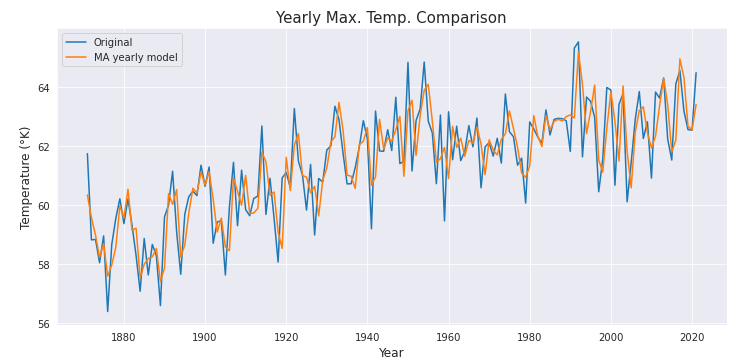

# Time Series Analysis For New York Temperature

In this project, we tried to fit different time series models to the New York Maximum and 
Minimum temperature data.

## Requirements

The program was written using a Python 3.9 environment, and the following libraries:

- [NumPy](http://www.numpy.org/)
- [Pandas](http://pandas.pydata.org/)
- [Matplotlib](http://matplotlib.org/)
- [Seaborn](https://seaborn.pydata.org/)
- [StatsModels](https://www.statsmodels.org/stable/index.html)
- [Scikit-Learn](https://scikit-learn.org/)


## Dataset

The data was obtained using the 
[NCEI API Service](https://www.ncei.noaa.gov/support/access-data-service-api-user-documentation).

On the terminal, run
```
get_data.py
```
to get the complete dataset.


## Results

We explored different Auto Regressive models, finally fitting one that gave us an Absolute Error 
of 2-3 °K.

For example, we got:

 

## Support

Give a :star: if you like it :hugs:.